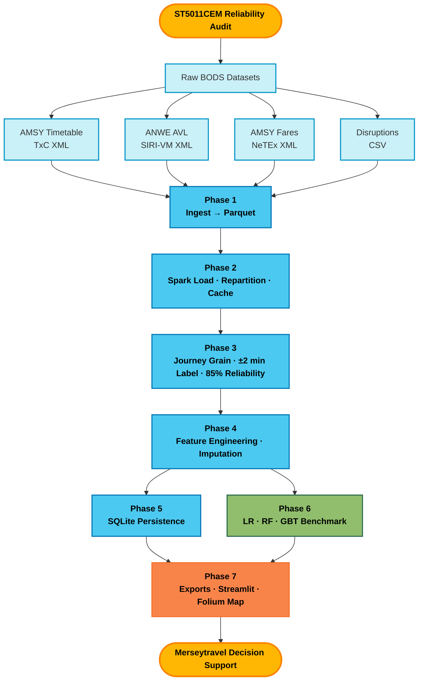
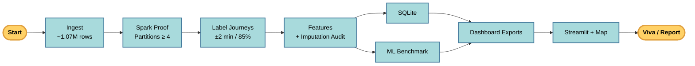
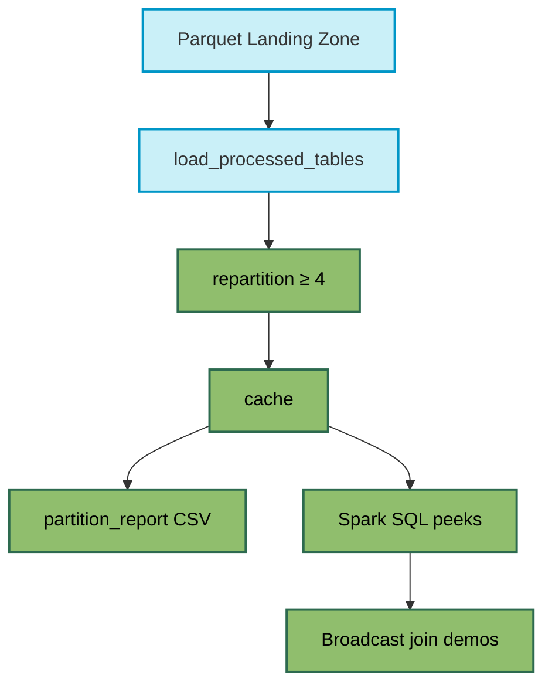

<div align="center">

# ST5011CEM Big Data Programming Project
### **Arriva Merseyside Fare-Aware Service Reliability Audit**
### Samriddha Raj Satyal
### Coventry University ID: 15940432

<p align="center">


-orange.svg)


</p>

---

### BSc. (Hons) in Computer Science with AI
### **Coventry University**
### **Softwarica College of IT and E-Commerce**

**Programming Language:** Python  
**Big Data Engine:** Apache Spark (PySpark)  
**Development Environment:** macOS + VS Code / Jupyter  
**Visualization:** Matplotlib · Seaborn · Streamlit · Folium  
**Data Sources:** UK BODS (TxC · SIRI-VM · NeTEx) · Merseytravel disruptions  

---

</div>

## Table of Contents

- [Project Overview](#project-overview)
- [Project Objectives](#project-objectives)
- [Repository Structure](#repository-structure)
- [Technology Stack](#technology-stack)
- [Repository Statistics](#repository-statistics)
- [Data Scale Summary](#data-scale-summary)
- [Overall System Architecture](#overall-system-architecture)
- [Coursework Workflow](#coursework-workflow)
- [Highlights](#highlights)
- [Phase 0 — Project Setup](#phase-0--project-setup)
- [Phase 1 — Data Ingest & Quality](#phase-1--data-ingest--quality)
- [Phase 2 — Spark Load & Big Data Proof](#phase-2--spark-load--big-data-proof)
- [Phase 3 — Journey Labelling & Reliability](#phase-3--journey-labelling--reliability)
- [Phase 4 — Feature Engineering](#phase-4--feature-engineering)
- [Phase 5 — SQLite Persistence](#phase-5--sqlite-persistence)
- [Phase 6 — Machine Learning Benchmark](#phase-6--machine-learning-benchmark)
- [Phase 7 — Stakeholder Dashboard & Exports](#phase-7--stakeholder-dashboard--exports)
- [Key Results](#key-results)
- [Execution Guide](#execution-guide)
- [Skills Demonstrated](#skills-demonstrated)
- [Learning Outcomes](#learning-outcomes)
- [Future Improvements](#future-improvements)

---

# Project Overview

This repository contains a complete **Big Data analytics pipeline** for a **fare-aware bus service reliability audit** framed for **Merseytravel / Liverpool City Region**. The system ingests multi-source UK Bus Open Data Service (BODS) feeds, processes them with **Apache Spark**, labels journeys against a **±2 minute** urban on-time rule, benchmarks reliability against an **85%** service threshold, trains compliance classifiers, and delivers an interactive **Streamlit** stakeholder dashboard.

The project bridges theoretical Big Data concepts (distributed ingest, partitioning, Spark SQL, feature engineering, ML evaluation) with a practical transport-authority decision-support story: identifying late-risk services and ranking them by **hypothetical fare exposure**  
(`P(non-compliant) × fare_proxy` — analytical prioritisation only, **not** a real DfT fine).

All core logic lives in a **self-contained Jupyter notebook** (`main.ipynb`). Supporting Python modules power the live dashboard and map exports.

---

# Project Objectives

The primary objectives of this coursework are to:

- Ingest and integrate multi-source BODS datasets (timetable, AVL, fares, disruptions) at scale.
- Demonstrate Big Data processing with **PySpark** (repartition ≥4, cache, broadcast joins, Spark SQL).
- Label journeys using a transparent **±2 minute** compliance rule.
- Measure service reliability against the **85%** line-level benchmark.
- Engineer temporal, disruption, fare, and history features with a documented imputation policy.
- Benchmark **Logistic Regression**, **Random Forest**, and **GBT** with CrossValidator.
- Persist analytical tables in **SQLite** with parameterised queries.
- Deliver a Streamlit dashboard with KPIs, risk views, scenario scoring, and a Folium network map.
- Produce reproducible artefacts under `outputs/` and `visuals/` for report and viva evidence.

---

# Repository Structure

```text
coursework/
│
├── main.ipynb   # Full Phases 0–7 pipeline
├── streamlit_dashboard.py                          # Stakeholder dashboard
├── trip_scorer.py                                  # GBT scenario scoring
├── map_exports.py                                  # Folium geo / route exports
├── requirements.txt
├── README.md
│
├── datasets/
│   ├── timetable/          # AMSY TxC XML
│   ├── location/           # ANWE SIRI-VM AVL (feed 709 + archive)
│   ├── fares/              # AMSY NeTEx fare XML
│   └── disruptions/        # Merseytravel disruption CSV
│
├── outputs/
│   ├── processed/          # Landing + analytical + feature Parquet
│   ├── data_quality/       # Quality + imputation audits
│   ├── reliability/        # Line / hour aggregates
│   ├── features/           # Feature metadata & samples
│   ├── machine_learning/   # Models, metrics, pipeline
│   ├── dashboard_exports/  # CSVs for Streamlit
│   ├── db/                 # SQLite database
│   └── database_schema/    # ER / schema notes
│
└── visuals/
    ├── data_exploration/
    ├── reliability/
    ├── model_evaluation/
    └── dashboard_charts/
```

---

# Technology Stack

| Category | Technology |
|-----------|------------|
| Language | Python 3 |
| Big Data Engine | Apache Spark (PySpark) |
| Notebook | Jupyter |
| Columnar Storage | Apache Parquet (PyArrow) |
| Relational Store | SQLite |
| ML (Spark MLlib) | LogisticRegression · RandomForest · GBT |
| Feature Pipeline | StringIndexer · OneHotEncoder · VectorAssembler |
| Evaluation | F1 · ROC-AUC · Confusion Matrices · Correlation Heatmap |
| Dashboard | Streamlit |
| Maps | Folium · streamlit-folium |
| Visualisation | Matplotlib · Seaborn |
| Data Sources | BODS TxC · SIRI-VM (ANWE feed 709) · NeTEx fares · Disruptions |
| Archive Support | National Data Library SIRI-VM (ANWE filter script) |

---

# Repository Statistics

| Metric | Value |
|---------|------:|
| Pipeline Phases | **8** (0–7) |
| Programming Language | **Python** |
| Core Notebook | **1** (self-contained) |
| Dashboard Modules | **3** |
| Raw Sources Integrated | **4** (TxC · AVL · Fares · Disruptions) |
| Total Rows Ingested | **~1.07 million (~10.7 lakh)** |
| AVL GPS Snapshots | **~5,000 XML files** |
| ML Classifiers Benchmarked | **3** (LR · RF · GBT) |
| Best Model | **GBT** |
| Reliability Lines Audited | **17** |
| Lines Below 85% Threshold | **17** |
| Dashboard Tabs | Network map · Reliability · Risk · Exposure · Calculator |

---

# Data Scale Summary

Multi-source BODS landing tables are ingested into Parquet. Combined landing volume is on the order of **ten lakh+ rows** (~**1.07 million** records across timetable events, live AVL vehicle activities, fare proxies, and disruption records).

| Dataset | Approximate Rows | Source / Grain |
|---------|-----------------:|----------------|
| Timetable schedule events | **769,705** | AMSY TxC stop/schedule events |
| AVL vehicle activities | **279,198** | ANWE SIRI-VM GPS pings (feed 709 + archive days) |
| Timetable vehicle journeys | **15,775** | AMSY vehicle journey defs |
| Disruptions | **2,025** | Merseytravel / synthetic disruption events |
| Fare line proxies | **63** | AMSY NeTEx line-level fare proxy |
| **Total ingested (landing)** | **≈ 1,066,766** | **~10.7 lakh / ~1.07M rows** |

> **Note:** AVL rows are GPS **pings**. Phase 3 aggregates them to **journey grain** for compliance labelling and ML. The Big Data claim is the multi-source landing scale and Spark processing — not ping-level ML.

---

# Overall System Architecture



---

# Coursework Workflow



---

# Highlights

- Self-contained multi-phase Big Data notebook (no `src/` package required)
- ~**1.07 million** multi-source landing rows (~**10.7 lakh**) ingested to Parquet
- PySpark evidence: repartition, cache, broadcast joins, Spark SQL peeks
- ±2 minute journey compliance labelling + 85% line reliability audit
- Typed missing-data policy (structural zeros · network median fares · history priors · missingness flags)
- ML benchmark: Logistic Regression · Random Forest · **GBT (best)**
- Confusion matrices for all three models + feature correlation heatmap
- SQLite persistence with parameterised queries
- Streamlit stakeholder dashboard with Folium network map
- Hypothetical fare-exposure ranking for authority prioritisation
- Reproducible artefacts under `outputs/` and `visuals/`

---

# Phase 0 — Project Setup

## Overview

Phase 0 configures the project environment: paths, output folders, quiet logging, and the **PySpark session factory**.

## Spark Initialisation

Spark is defined in Phase 0 and created in Phase 2:

```python
def get_spark(app_name="Merseyside_Reliability_Audit"):
    spark = (
        SparkSession.builder.appName(app_name)
        .master("local[*]")
        .config("spark.driver.memory", "4g")
        .config("spark.sql.shuffle.partitions", "8")
        .config("spark.serializer", "org.apache.spark.serializer.KryoSerializer")
        .config("spark.sql.adaptive.enabled", "true")
        .getOrCreate()
    )
    spark.sparkContext.setLogLevel("ERROR")
    return spark

# Phase 2 run cell
spark = quiet_spark(get_spark("Phase2_Spark_Lab"))
```

## Key Constants

| Constant | Value | Role |
|----------|------:|------|
| Urban on-time tolerance | **±2 minutes** | Journey compliance |
| Service reliability threshold | **0.85 (85%)** | Line-level audit |
| Min Spark partitions | **≥ 4** | Big Data coursework proof |

---

# Phase 1 — Data Ingest & Quality

## Overview

Raw BODS XML/CSV files are parsed into clean landing Parquet tables with null profiling and a written data-quality report.

## Sources

| Source | Operator Context | Format |
|--------|------------------|--------|
| Timetable | AMSY (Arriva Merseyside) | TxC XML |
| Live / archived AVL | ANWE (Arriva North West, feed 709) | SIRI-VM XML |
| Fares | AMSY | NeTEx XML |
| Disruptions | Merseytravel (+ synthetic) | CSV |

## Features

| Feature | Status |
|---------|:------:|
| TxC timetable ingest | ✅ |
| SIRI-VM AVL ingest | ✅ |
| NeTEx fare proxy | ✅ |
| Disruption ingest | ✅ |
| Parquet landing zone | ✅ |
| Null / dtype quality report | ✅ |
| EDA charts | ✅ |

## Historical AVL Collection

Additional ANWE snapshots can be pulled from the National Data Library archive via:

```bash
cd datasets/location
python3 fetch_anwe_archive_day.py --date YYYY-MM-DD
# or faster sample:
python3 fetch_anwe_archive_day.py --date YYYY-MM-DD --stride 5
```

Filtered ANWE XML is written as `snapshots/avl_709_*.xml` so Phase 1 ingest needs no code change.

---

# Phase 2 — Spark Load & Big Data Proof

## Overview

Landing Parquet tables are loaded into Spark DataFrames, repartitioned (target ≥4 partitions), cached, and inspected with Spark SQL. Partition utilisation is exported for report evidence.

## Architecture



---

# Phase 3 — Journey Labelling & Reliability

## Overview

Thousands of AVL GPS pings are collapsed to **one row per journey**. Delay is computed from recorded vs aimed departure; compliance uses **|delay| ≤ 2 minutes**. Fares and disruptions are attached; service reliability is aggregated by line / hour against the **85%** threshold.

## Compliance Rule

```text
delay_minutes = recorded_at − origin_aimed_departure
is_compliant  = 1 if |delay_minutes| ≤ 2 else 0
```

## Label Validation (current run)

| Group | Journeys | Mean Delay (min) |
|-------|--------:|-----------------:|
| Non-compliant (`0`) | 604 | **57.51** |
| Compliant (`1`) | 817 | **0.23** |
| **Overall compliance** | **1,421** | **57.5%** |

The ±2 minute threshold cleanly separates near-zero delay trips from late behaviour. Labels are consistent before ML.

## Reliability Audit

| Metric | Result |
|--------|-------:|
| Lines in reliability aggregate | **17** |
| Lines below 85% | **17** |
| Observed compliance (overall) | **57.5%** |

---

# Phase 4 — Feature Engineering

## Overview

Temporal, fare, disruption, GPS, and **leakage-safe historical line features** are assembled into an ML feature vector (StringIndexer → OneHotEncoder → VectorAssembler).

## Missing-Data Policy

| Type | Rule |
|------|------|
| Structural absence (no disruption / no match) | Fill **0** + flags |
| Fare join failure (ANWE ↔ AMSY) | Network **median** + `fare_imputed` |
| Operational numerics (schedule / GPS) | Line median → network median |
| Categoricals | Explicit sentinels (`unknown` / `none`) |
| Cold-start history | Neutral prior (e.g. 0.5 non-compliance rate) |

Imputation audit is written to `outputs/data_quality/imputation_audit.json`.

---

# Phase 5 — SQLite Persistence

## Overview

Analytical journeys and reliability aggregates are stored in SQLite for SQL evidence and parameterised querying.

| Artefact | Path |
|----------|------|
| Database | `outputs/db/` |
| Schema notes | `outputs/database_schema/` |

---

# Phase 6 — Machine Learning Benchmark

## Overview

Three Spark MLlib classifiers are tuned with **CrossValidator** on the train split and evaluated on a held-out test set.

## Train / Test Split

| Split | Rows |
|-------|-----:|
| Train | **976** |
| Test | **445** |

## Model Comparison (held-out test)

| Model | Accuracy | F1 | ROC-AUC | Train Time (s) |
|-------|---------:|---:|--------:|---------------:|
| Logistic Regression | 0.739 | 0.721 | 0.794 | ~22 |
| Random Forest | 0.771 | 0.754 | 0.813 | ~8.5 |
| **GBT (best)** | **0.771** | **0.758** | **0.835** | ~17 |

**Selection rule:** highest F1, then ROC-AUC, then F1/sec → **GBT**.

## Confusion Matrix Interpretation (GBT, row-normalised)

Of true **late** trips, ≈**54%** are correctly predicted late and ≈**46%** are missed.  
Of true **on-time** trips, ≈**94%** are correctly predicted on-time.  
Matrices are also produced for **LR** and **RF** for viva comparison.

## Correlation Heatmap

Pearson correlations among numeric features and `label` show that historical non-compliance / delay features are negatively associated with on-time labels, while disruption features are positively associated. Constant fare proxies (network-median fallback) appear blank because correlation is undefined with zero variance.

---

# Phase 7 — Stakeholder Dashboard & Exports

## Overview

Phase 7 writes stakeholder CSVs and launches a Streamlit app for Merseytravel-style exploration.

## Dashboard Capabilities

| Tab / Feature | Description |
|---------------|-------------|
| Network map | Folium lines coloured by reliability / risk / exposure |
| Reliability | Lines vs 85% threshold |
| Risk | Trip / line / hour non-compliance probability |
| Exposure | Hypothetical `P(non-compliant) × fare_proxy` |
| Risk calculator | Interactive GBT scenario scoring |

## Run Dashboard

```bash
conda activate ai   # or your venv
streamlit run streamlit_dashboard.py
```

---

# Key Results

| Result | Value |
|--------|------:|
| Landing rows ingested | **≈ 1.07M (~10.7 lakh)** |
| AVL XML snapshots | **≈ 5,000** |
| Best ML model | **GBT** |
| Test F1 | **0.758** |
| Test ROC-AUC | **0.835** |
| Test accuracy | **0.771** |
| Overall observed compliance | **57.5%** |
| Lines below 85% | **17 / 17** |
| Hypothetical exposure | Prioritisation metric only (not a real fine) |

---

# Execution Guide

## 1. Setup

```bash
cd coursework
python3 -m pip install -r requirements.txt
export PYSPARK_PYTHON="$(which python3)"
export PYSPARK_DRIVER_PYTHON="$(which python3)"
```

## 2. Run Full Pipeline

1. Open `main.ipynb`
2. Run cells **top → bottom** (Phase 0 → Phase 7)
3. Artefacts appear under `outputs/` and `visuals/`

## 3. Launch Dashboard

```bash
streamlit run streamlit_dashboard.py
```

## 4. Optional — Collect More AVL Days

```bash
cd datasets/location
caffeinate -dims python3 fetch_anwe_archive_day.py --date 2026-06-16
# then re-run notebook Phase 1 → 7
```

---

# Skills Demonstrated

| Category | Topics Covered |
|----------|----------------|
| Big Data Ingest | Multi-source BODS XML/CSV → Parquet |
| Distributed Processing | PySpark sessions, repartition, cache, broadcast |
| SQL Analytics | Spark SQL + SQLite parameterised queries |
| Reliability Engineering | ±2 min compliance · 85% service threshold |
| Feature Engineering | OHE · history windows · imputation audit |
| Machine Learning | LR · RF · GBT · CrossValidator · ROC / F1 |
| Model Diagnostics | Confusion matrices · correlation heatmap |
| Stakeholder Delivery | Streamlit · Folium map · CSV exports |
| Reproducibility | Notebook pipeline · `requirements.txt` · output folders |

---

# Learning Outcomes

Upon completion, the following competencies were developed:

- End-to-end Big Data pipeline design for transport open data
- Practical PySpark usage for landing-zone scale (~10 lakh+ rows)
- Journey-grain labelling and service reliability auditing
- Documented missing-value strategies suitable for viva defence
- Comparative ML evaluation with transparent model selection
- Building a stakeholder-facing analytics dashboard
- Linking probabilistic risk to fare-aware prioritisation (hypothetical exposure)
- Producing report-ready charts, audits, and schema evidence

---

# Future Improvements

- Longer AVL archive windows (multi-week / multi-month) with day-zip resume downloads
- Stronger AMSY ↔ ANWE line-key alignment for fare and timetable joins
- Demand / crowding proxies if passenger data becomes available
- Online scoring service (API) wrapping the saved GBT pipeline
- Zone-redundant cloud deployment of the dashboard
- Additional schedulers / cost-aware model selection for larger grids

---

<div align="center">

**ST5011CEM · Arriva Merseyside Fare-Aware Service Reliability Audit**  
Samriddha Raj Satyal · 15940432 · Softwarica College / Coventry University
</div>
