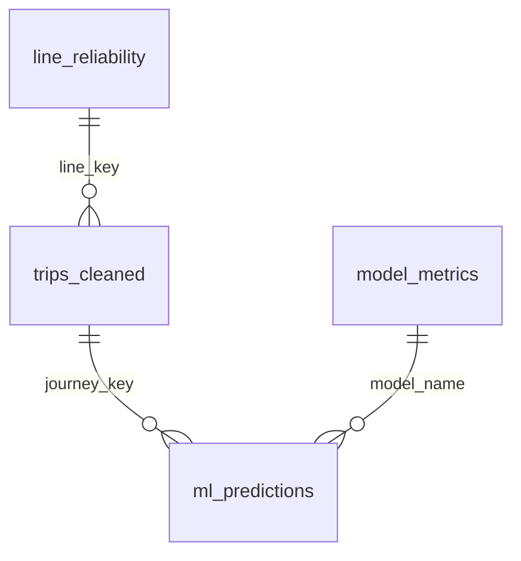

# Database schema
SQLite: `/Users/suhritsatyal/Desktop/softwarica_bachelors/big-data-coursework/outputs/db/merseyside_reliability_audit.sqlite`

Parameterised SQL only (`?` placeholders).

```mermaid
erDiagram
    trips_cleaned ||--o{ ml_predictions : journey_key
    line_reliability ||--o{ trips_cleaned : line_key
    model_metrics ||--o{ ml_predictions : model_name
```
